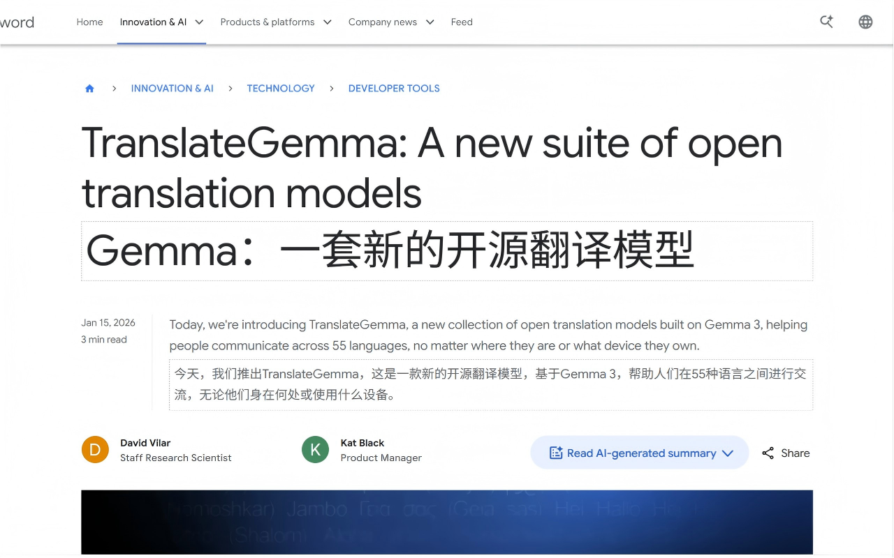

# Translate Minimal

A minimal Chrome extension for webpage translation. Press Ctrl to instantly translate the paragraph under your cursor.

[🇨🇳 中文文档](README_CN.md)




## Features

- **Ctrl to Translate** — Hover over any paragraph and press Ctrl to translate instantly
- **Dashed Border Style** — Translations appear below the original text with a clean dashed border
- **3 Translation Engines**:
  - Google Translate (default, free, no config needed)
  - Microsoft Translate (free, auto token refresh)
  - Ollama (local, supports translategemma and other models)

## Installation

1. Clone this repository:

   ```bash
   git clone https://github.com/wenzhiding/translate_minimal.git
   ```

2. Open Chrome and navigate to `chrome://extensions/`

3. Enable **Developer mode** (top-right toggle)

4. Click **Load unpacked** and select the cloned folder

5. The translate icon will appear in the toolbar

## Usage

1. Click the toolbar icon to select a translation engine and target language
2. On any webpage, hover your cursor over the text you want to translate
3. **Press Ctrl** — the translation appears instantly below the original text

### Using Ollama for Local Translation

1. Install [Ollama](https://ollama.com)
2. Pull a translation model:

   ```bash
   ollama pull translategemma:4b
   ```

3. Select **Ollama** as the translation engine in the extension popup
4. Click **Options** to change the Ollama URL or select a different model

## File Structure

```
├── manifest.json    # Extension manifest (Manifest V3)
├── background.js    # Background service: translation API calls
├── content.js       # Content script: Ctrl+hover paragraph detection
├── inject.css       # Injected styles: dashed border theme
├── popup.html/js    # Popup: engine/language selection
├── options.html/js  # Options page: Ollama configuration
├── rules.json       # Network request rules (Ollama CORS)
└── icons/           # Extension icons
```

## License

MIT
